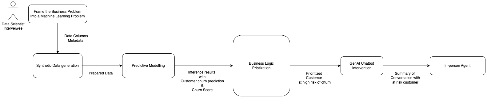
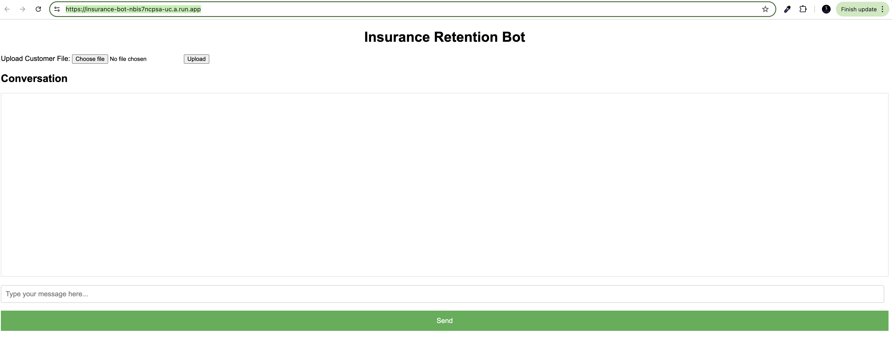
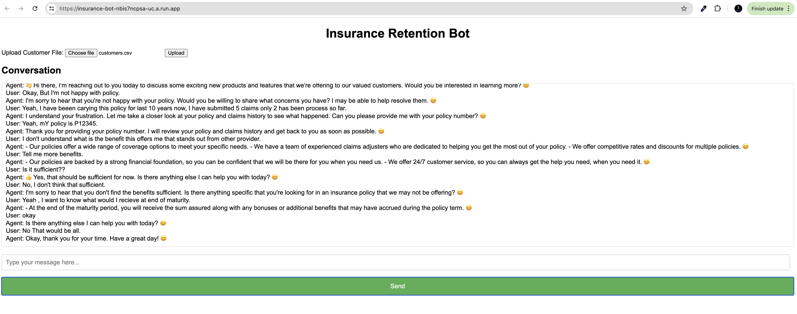

# Insurance Churn Prediction Model

## Problem Statement.

In this exercise, you are required to showcase your knowledge and skills in applying AI/ML
techniques to help Prudential gain a competitive edge. Given that real-world data can be scarce and
sometimes inaccessible to Data Scientists, and yet you need to demonstrate AI/ML can bring value
to business in a responsible way. To overcome this challenge, you have decided to use a "synthetic
data" approach to illustrate how your solution can be applied by first generating the data yourself.

- Implement an early lapse prediction model to improve customer retention and churn rate by
  triggering prompts/agent follow-up.

Given a short problem statement engage in a meaningful understanding to scope the problem and use it to convert business problem into a machine learning and Gen AI problem is the key.

## Clarifying requirements and Methodology adopted.

### Clarifying requirements

Let's begin by understanding the scope of the problem more clearly.

Customer Journey: Can you describe the typical customer journey and at what points you believe customers are at risk of lapsing?
Data Availability: Although we will be using synthetic data, understanding the types of data usually available (customer demographics, transaction history, engagement metrics) will help us generate realistic synthetic data.
Business Goals: What are the primary business metrics we're aiming to improve? Is it reducing churn rate by a certain percentage, increasing customer lifetime value, or something else?
Intervention Mechanisms: What are the current intervention methods? Are we using email prompts, push notifications, direct agent calls, or a combination of these?
Timeliness: How early do we need to predict the lapse for the intervention to be effective? Are there specific time frames or critical points in the customer lifecycle?
Success Metrics: How do we measure the success of the interventions? Are we tracking re-engagement rates, changes in customer behavior, or other metrics?

### Methodology

With these details in mind, let's break down the problem into a machine learning and generative AI problem:

Data Collection and Preprocessing:

- Synthetic Data Generation: Since real-world data is scarce, we'll generate synthetic data that mimics real customer data. This includes customer demographics, transaction history, engagement metrics, and support interactions.
- Feature Engineering: Create features that capture customer behavior and interaction patterns. This could include features like recency, frequency, and monetary value (RFM), engagement scores, and sentiment analysis from support interactions.
- Labeling: Define what constitutes a "lapsed" customer. This could be based on inactivity for a certain period, a drop in engagement metrics, or cancellation of services.

- Predictive Modeling:

  - Model Selection: Choose appropriate machine learning models for predicting lapse. This could involve classification models like logistic regression, random forests, gradient boosting machines, or neural networks.
  - Training and Validation: Split the synthetic data into training and validation sets, and train the models to predict the probability of a customer lapsing. Evaluate the models using metrics like precision, recall, F1-score, and ROC-AUC.

- Intervention Strategy:

  - Trigger Mechanisms: Develop a system to trigger interventions based on the model's predictions. This could be automated chatbot prompts, email propmts, push notifications, or tasks assigned to customer service agents.
  - Personalization: Use generative AI models to create personalized messages for each customer. This could involve generating email content, push notification text, or call scripts that are tailored to the customer's behavior and preferences.

- Monitoring and Feedback Loop:
  - Real-time Monitoring: Implement a system to monitor customer activity and model predictions in real-time. This allows for timely interventions.
  - Feedback Loop: Continuously collect data on the effectiveness of the interventions. Use this data to retrain and improve the model, ensuring it adapts to changing customer behavior over time.

This Repository holds code for the part second part where we are toenagage customer at risk in conversation by automated GenAI chatbot to understand and try to resolve the customers issue.



### `README.md`

# Insurance Customer Retention Bot

This project is a Streamlit application designed to help insurance companies retain customers at high risk of churn. The bot engages in a conversation with the customers, addresses their concerns, and highlights the benefits of staying with their current policy.

## Folder Structure

```

.
├── app.py
├── bot/
│ ├── init.py
│ ├── gpt_agent.py
│ └── utils.py
├── static/
│ ├── styles.css
│ └── script.js
├── templates/
│ └── index.html
├── Dockerfile
├── requirements.txt
└── README.md

```

### Files and Directories

- **app.py**: Main Streamlit application file that sets up the UI and handles user interactions.
- **gpt_agent.py**: Contains the `GPT` class and related chains (StageAnalyzerChain and ConversationChain).
- **utils.py**: Utility functions for loading customer data and initializing the agent.
- **config.py**: Configuration settings (currently empty but can be used for future configurations).
- **data/**: Directory to store the sample CSV file (`customers.csv`).
- **requirements.txt**: List of dependencies required to run the application.

## Sample CSV File

Ensure your CSV file (`customers.csv`) in the `data/` directory contains the following fields:

| First Name | Last Name | Gender | Age | Region | Occupation | Policy Number | Policy Start Date | Policy Expiry Date | Premium Type | Product Type | Satisfaction Score | Number of Late Payments | Preferred Communication Channel | Number of Customer Service Interactions | Number of Claims Filed | Total Claim Amount | Claim Frequency | Credit Score | Debt-to-Income Ratio |
| ---------- | --------- | ------ | --- | ------ | ---------- | ------------- | ----------------- | ------------------ | ------------ | ------------ | ------------------ | ----------------------- | ------------------------------- | --------------------------------------- | ---------------------- | ------------------ | --------------- | ------------ | -------------------- |
| John       | Doe       | Male   | 45  | East   | Engineer   | P123456       | 2019-01-01        | 2024-01-01         | Monthly      | Life         | 80                 | 1                       | Email                           | 2                                       | 0                      | 0                  | 750             | 0.35         |
| Jane       | Smith     | Female | 50  | West   | Teacher    | P654321       | 2018-06-01        | 2023-06-01         | Quarterly    | Health       | 70                 | 3                       | Phone                           | 4                                       | 2                      | 5000               | 0.4             | 720          | 0.30                 |

## How It Works

1. **Upload Customer Data**: Upload the `customers.csv` file containing details of customers at high risk of churn.
2. **Start Conversation**: Click the "Start Conversation" button to begin the interaction with a selected customer.
3. **Progress Through Stages**: The bot will progress through predefined conversation stages, addressing the customer's concerns and highlighting policy benefits.

## Key Components

### app.py

The main entry point of the application. It sets up the Streamlit interface and handles user interactions.

### gpt_agent.py

Contains the `GPT` class, which manages the dialogue flow and interactions. It includes:

- **StageAnalyzerChain**: Determines the current stage of the conversation based on history.
- **ConversationChain**: Generates appropriate responses based on the conversation stage and history.

### utils.py

Utility functions for loading customer data and initializing the GPT agent.

### config.py

Configuration settings for the application (currently empty but can be extended).

## Sample Data

A sample `customers.csv` file is provided in the `data/` directory to demonstrate the required data structure and fields.

## Deployed Demostration

Solution is deployed on GCP using contanizered Image of the code here.

https://insurance-bot-nbis7ncpsa-uc.a.run.app/

### Demo

- Step 1 : Upload your file need to talk to high churn risk customer prediction. [provided under data folder]
  

- Step 2 : Start Conversation.
  
